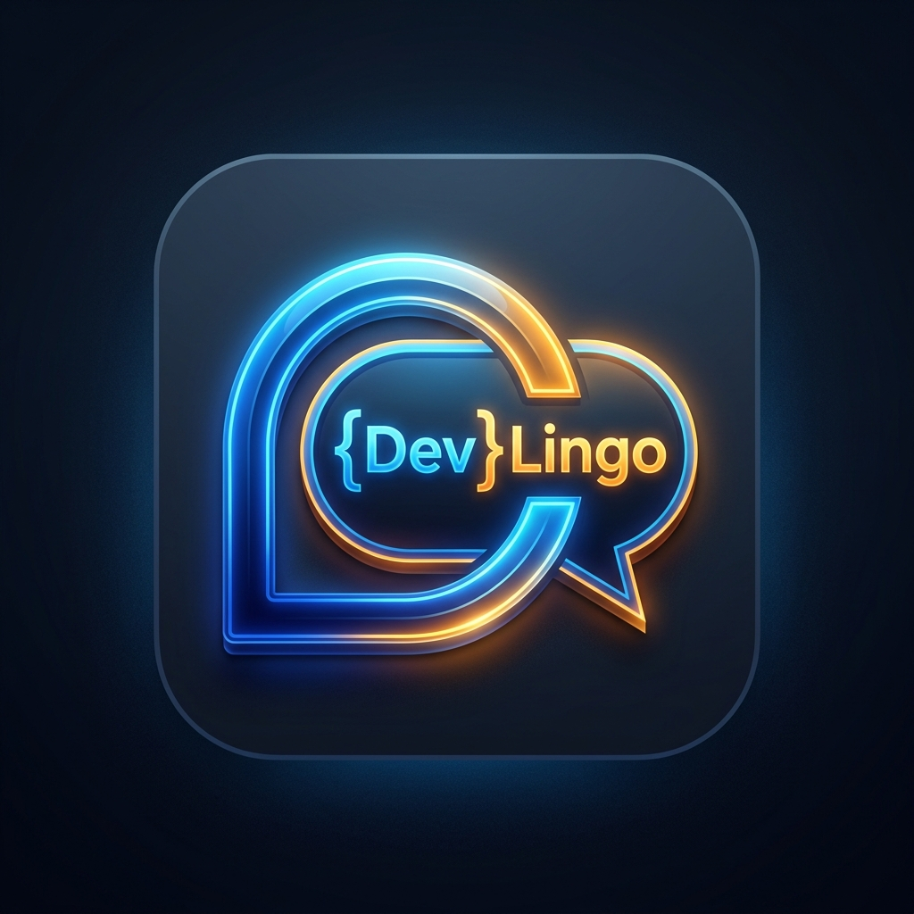
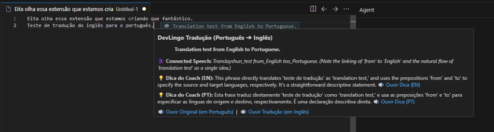
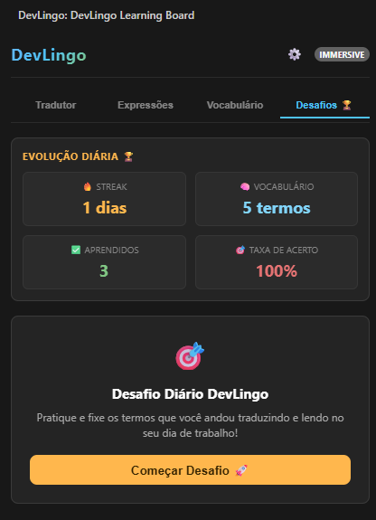
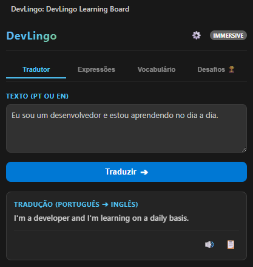
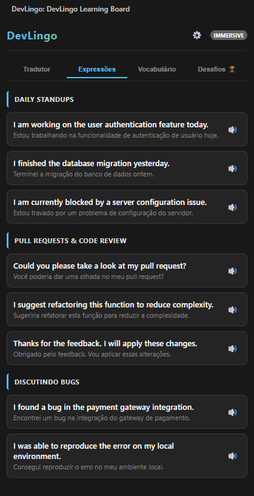
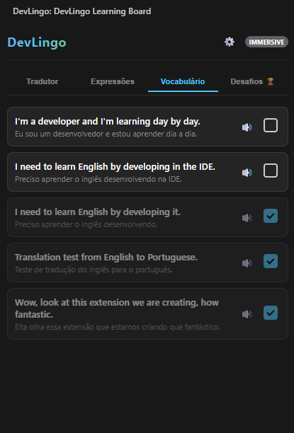

  

# DevLingo 🏆 - Seu Coach de Inglês no VS Code

O **DevLingo** é uma extensão inteligente para o VS Code que atua como seu coach de inglês pessoal durante o expediente. Ele ajuda desenvolvedores a traduzirem códigos, documentações e mensagens, ensina pronúncias do dia a dia da área de TI e acompanha a sua evolução diária por meio de gamificação e testes interativos.

---

## 🚀 Principais Recursos

### 1. Tradução Inteligente com Coach de IA (Gemini)
* **Pronúncia (IPA simples) 🗣️**: Descubra como pronunciar a tradução através de uma transcrição fonética simplificada e adaptada para falantes do português brasileiro (ex: *people* ➔ *pí-pəl*, *busy* ➔ *bí-zi*). Utiliza acentuação amigável para indicar a sílaba tônica de forma extremamente intuitiva.
* **Dicas do Coach (Novas Expressões)**: O Coach sugere e ensina uma nova expressão em inglês relacionada à tradução para você expandir seu vocabulário. Cada dica inclui a frase em inglês com sua pronúncia IPA simplificada, e a respectiva tradução/contexto em português (ex: *"I'm doing well, how about you? (ái-m dú-in uél, háu a-báut iú?)"*).
* **Cache Inteligente**: Suas traduções anteriores são salvas localmente para carregar em 0ms (offline), economizando dados e requisições da API.

---

### 2. Painel de Desafios e Evolução Diária (Desafios 🏆)
Acompanhe seu progresso diretamente pela barra lateral:
* **🔥 Streak Diária**: Dias consecutivos em que você praticou inglês.
* **🧠 Vocabulário**: Total de termos já traduzidos.
* **✅ Aprendidos**: Quantidade de termos fixados (marcados no histórico ou validados no Quiz).
* **🎯 Taxa de Acerto**: Estatística percentual de acertos nas perguntas do Quiz.
* **Quiz Interativo**: Desafios de 3 perguntas geradas dinamicamente com base nas expressões que você traduziu na extensão!

---

### 3. Tradutor, Expressões e Portfólio ("Baixar Apostila")
* **Tradutor Dinâmico**: Tradução rápida bidirecional diretamente no painel.
* **Expressões Úteis**: Guia prático de expressões comuns no dia a dia dev (Daily standups, Pull Requests, Code Reviews, Bugs, etc.).
* **📥 Baixar Apostila**: Exporte todo o seu portfólio de estudos acumulado em um lindo arquivo Markdown (`.md`) estruturado contendo suas traduções, pronúncias IPA e dicas do coach diretamente no seu workspace para revisão offline.
* **Checklist de Vocabulário**: Marque as frases do histórico como "aprendidas" e revise suas pronúncias a qualquer hora.

  
  
  

---

### 4. Traduzir de Qualquer Lugar (`Ctrl + Alt + Y`)
Traduza seleções em qualquer parte da IDE:
* **No Editor**: Basta selecionar o bloco de código ou texto e pressionar `Ctrl + Alt + Y` (ou `Cmd + Alt + Y` no Mac).
* **Em Chats, Terminais ou Logs**:
  1. Selecione o texto que deseja traduzir.
  2. Pressione **`Ctrl + C`** para copiar.
  3. Clique no editor de texto para dar foco.
  4. Pressione **`Ctrl + Alt + Y`**!
  O balão de tradução aparecerá instantaneamente com opções de áudio e detalhamento no painel.

### 5. Áudio Nativo Instantâneo com Zero Latência (Windows)
* **Truque do Seek Dinâmico**: O motor de áudio nativo do Windows inicia o player e aguarda dinamicamente (em menos de 70ms) até a placa de som acordar do modo de suspensão, retrocedendo o áudio para o início imediatamente. Isso garante a reprodução de **toda a frase, sem cortes de palavras e sem atraso perceptível**.
* Ouça pronúncias usando a **Voz Humana Online do Google (TTS)** ou as **Vozes Locais Offline** instaladas em seu sistema.

### 6. Seleção de Modelos do Gemini & Economia de API
* **Escolha do Modelo Ideal**: Alterne entre diferentes modelos da família Gemini, incluindo as últimas versões como `Gemini 3.5 Flash` (padrão recomendado), `Gemini 3.1 Flash-Lite`, `Gemini 2.5 Flash` e muito mais, diretamente no painel.
* **Economia de API no Hover**: Ative ou desative o uso da API do Gemini para os balões de hover/inline nas configurações para economizar requisições e cotas da API gratuita.
* **Avisos de API Inteligentes**: Alertas discretos e específicos integrados na interface em caso de limites de requisições excedidos (Erro 429) ou indisponibilidade temporária do servidor (Erro 503), sem popups intrusivos atrapalhando seu código.

---

## ⚙️ Configuração Inicial

Para habilitar a experiência completa com dicas do Coach de IA (Gemini):
1. Acesse o painel do **DevLingo** na barra lateral.
2. Clique no ícone de engrenagem (**⚙️**) para abrir as configurações.
3. Insira sua **Chave de API do Gemini** (você pode gerar uma gratuitamente no [Google AI Studio](https://aistudio.google.com/)).
4. Selecione o **Modelo do Gemini** de sua preferência no menu de seleção (como `Gemini 3.5 Flash` para melhor estabilidade e cota, ou versões `Lite`).
5. Defina o motor de voz (Online ou Offline) e a velocidade ideal para os seus estudos.

---

## ⌨️ Atalhos de Teclado Úteis

| Atalho | Ação |
| :--- | :--- |
| `Ctrl + Alt + Y` / `Cmd + Alt + Y` | **Traduzir de Qualquer Lugar**: Traduz a seleção atual ou o texto da Área de Transferência. |
| `Ctrl + Alt + T` / `Cmd + Alt + T` | **Substituir Código**: Traduz o texto selecionado e substitui o original diretamente em seu arquivo. |
| `Ctrl + Alt + C` / `Cmd + Alt + C` | **Comentário Bilíngue**: Traduz a seleção e insere um comentário formatado com a versão em Inglês e Português. |

---

## 🧑‍💻 Créditos & Desenvolvimento

Esta extensão foi desenvolvida e idealizada por:
* **Jean Everton** - [LinkedIn Profile](https://www.linkedin.com/in/jeanevertonoficial/)

---

## 📄 Licença

Este projeto está licenciado sob a Licença MIT - consulte o arquivo [LICENSE](LICENSE) para obter mais detalhes.

---

Desenvolvido para ajudar você a conquistar sua próxima vaga internacional ou ler documentações técnicas sem barreiras! 🌐🚀

